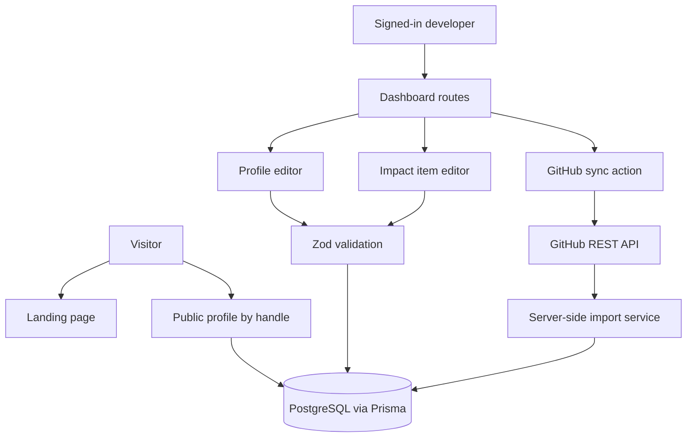
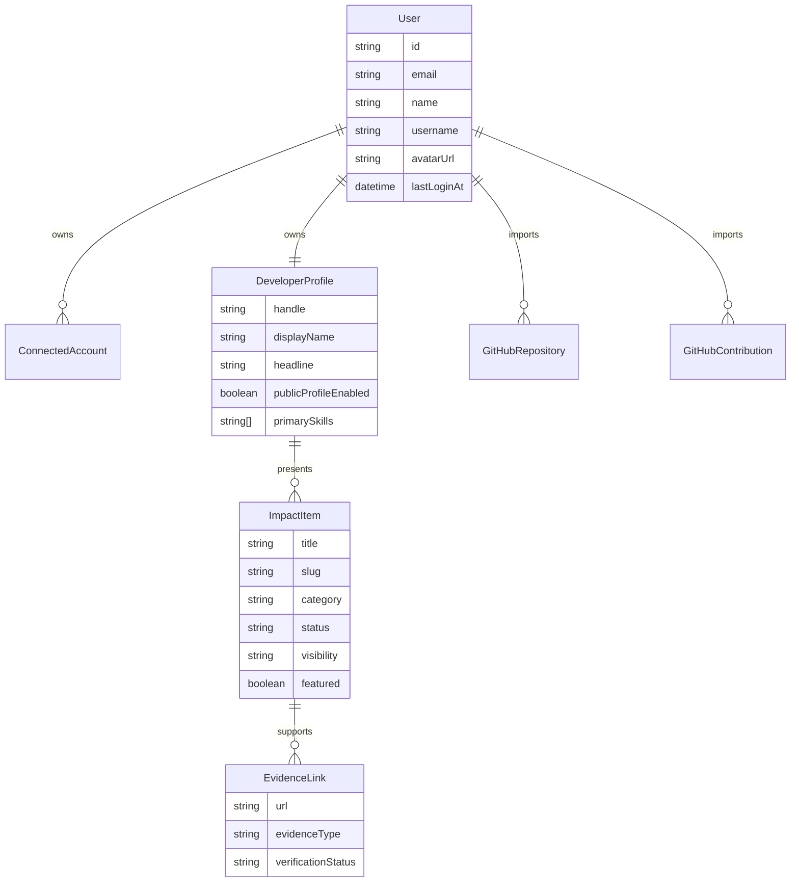
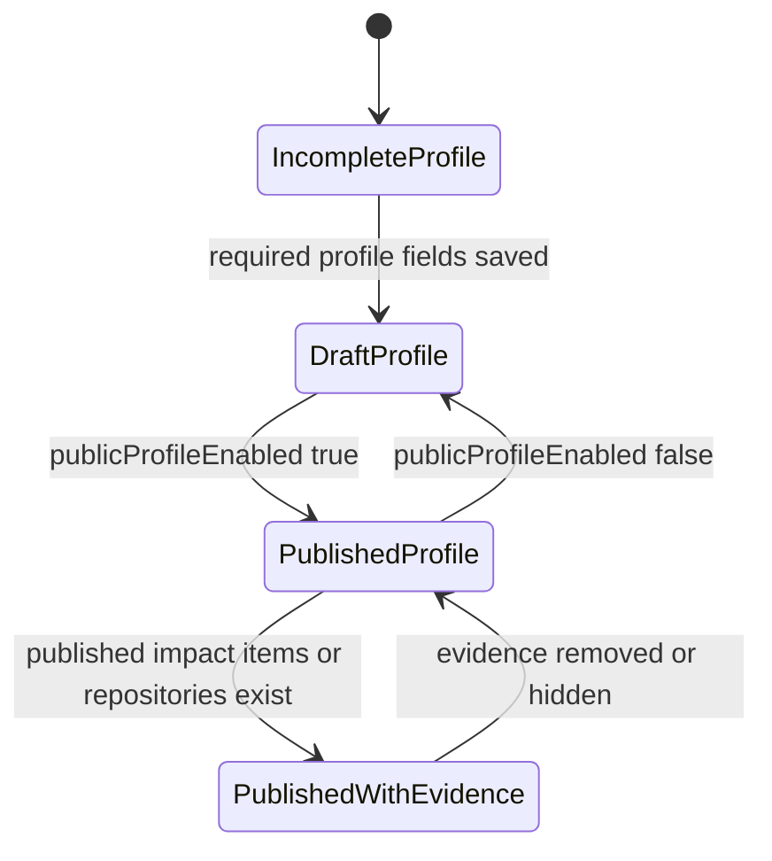

# feat: Build Evidence-First Developer Impact Profile MVP

## Summary

Build OpenSource Impact Tracker into a developer-first impact profile platform. The MVP should move beyond the current GitHub-only lookup prototype into authenticated, persisted, evidence-backed public profiles with GitHub import, manual impact items, evidence links, dashboard management, responsive polish, and launch-ready documentation.

---

## Technical Baseline Report

The current repository is a small Next.js app with a working GitHub public-data lookup and no persistence or authentication.

| Area | Current state |
|---|---|
| Framework | Next.js App Router in `src/app/`, currently `next@16.1.1` |
| UI runtime | React 19 with TypeScript strict mode |
| Styling | Tailwind CSS 4 via `src/app/globals.css` and utility classes |
| Package manager | npm with `package-lock.json` |
| Data layer | None; all current data is fetched live from public GitHub REST endpoints |
| Auth | None |
| Existing routes | `src/app/page.tsx`, `src/app/api/contributions/route.ts` |
| Existing components | `src/components/impact/ImpactDashboard.tsx` |
| Existing GitHub logic | `src/lib/github/client.ts`, `src/lib/github/profile.ts`, `src/lib/github/types.ts` |
| Tests | Vitest, React Testing Library, jsdom in `src/components/impact/ImpactDashboard.test.tsx` and `src/lib/github/profile.test.ts` |
| Build/lint/test | `npm run build`, `npm run lint`, `npm test` |
| Current plan | `docs/plans/2026-06-22-001-feat-impact-tracker-mvp-plan.md`, now superseded by this broader MVP plan |

Current gaps against the product vision are material: no user accounts, no saved profiles, no manual impact items, no evidence model, no profile publishing controls, no dashboard route structure, no profile editing, no database, no GitHub OAuth, no repository sync history, and no public handle route.

---

## Problem Frame

The existing app answers "what public GitHub activity can we fetch for this username right now?" The product vision asks a broader question: "what impact has this developer made?" That requires a durable profile model, evidence-first content, explicit verification labels, and a public presentation that can be trusted by recruiters, maintainers, founders, visa assessors, and community leaders.

The MVP should preserve the working GitHub lookup as a useful ingestion primitive, but reposition GitHub as one evidence source among many.

---

## Requirements

### Product Identity

- R1. The app presents a public developer impact profile, not a generic GitHub stats dashboard or vanity score generator.
- R2. Major claims on a public profile are backed by GitHub records, evidence URLs, or honest self-reported verification labels.
- R3. The MVP defers social graph features until the evidence, profile, dashboard, and publishing foundation are stable.

### Authentication and Persistence

- R4. A developer can sign in with GitHub using minimal permissions and without exposing OAuth tokens to the frontend.
- R5. First sign-in creates or links a user record, connected GitHub account, and developer profile.
- R6. Profile, repository, impact item, and evidence data are persisted in a relational database.
- R7. Private or unpublished profile and impact data are not visible on public pages.

### Profile and Dashboard

- R8. A signed-in developer can edit display name, handle, headline, bio, location, website, GitHub username, avatar, banner, and skills.
- R9. A visitor can view a polished public profile at a handle-based route when publishing is enabled.
- R10. The dashboard shows profile completeness, GitHub sync status, last synced date, imported repository count, item counts, quick actions, and recent activity.
- R11. Dashboard pages cover home, edit profile, GitHub connection/sync, impact item list, new impact item, edit impact item, and settings.

### GitHub Import

- R12. A signed-in developer can import public GitHub profile and repository data into saved repository records.
- R13. GitHub sync handles API failures, rate limits, and partial data without breaking the dashboard.
- R14. Imported GitHub repositories are clearly labeled as GitHub verified evidence.

### Impact Items and Evidence

- R15. A developer can create, edit, draft, publish, archive, feature, hide, and tag impact items across the requested categories.
- R16. Impact items support project, article, talk, workshop, meetup, podcast, mentoring, open source, documentation, research, tutorial, video, community, hackathon, and award categories.
- R17. A developer can attach multiple evidence links to an impact item.
- R18. Evidence links support the requested evidence types and verification statuses.
- R19. Public profile sections show published items only, grouped into featured impact, repositories, articles, talks, community work, projects, and impact timeline.

### Quality and Launch Readiness

- R20. Core forms validate required fields, handles, enum values, and URLs before mutation.
- R21. Empty, loading, and error states are explicit across public and dashboard experiences.
- R22. The UI is responsive, premium, technical, credible, and shareable.
- R23. README documents setup, environment variables, database workflow, GitHub OAuth setup, verification commands, and MVP limitations.
- R24. Tests cover model-independent validation, GitHub import mapping, dashboard/profile rendering, and public visibility boundaries.

---

## Key Technical Decisions

- KTD1. Keep the existing Next.js App Router stack: The repo is already a strict TypeScript Next.js 16 app with Tailwind and Vitest, so the MVP should extend that foundation instead of rewriting into a different framework.
- KTD2. Add PostgreSQL with Prisma for persistence: The product requires saved profiles, accounts, repositories, impact items, evidence links, visibility controls, and sync timestamps; Prisma matches the requested stack and has official Next.js setup guidance for schema, migrations, generated client, and seed data.
- KTD3. Use Auth.js / NextAuth with GitHub provider for sign-in: Auth.js documents GitHub provider setup, the Next.js route handler shape, `AUTH_SECRET`, and GitHub callback URL conventions. This fits the existing App Router codebase and keeps OAuth handling server-side.
- KTD4. Request minimal GitHub OAuth permissions first: GitHub documents `(no scope)` as read-only public access and `read:user` as profile access. The MVP should avoid `repo` and private-repo scopes unless a later product decision explicitly needs private data.
- KTD5. Avoid persistent OAuth token storage for the first MVP unless implementation proves it is necessary: Public repository import can use public GitHub endpoints keyed by the connected GitHub username. If an Auth.js adapter or sync path must persist a GitHub token, store it only in server-readable fields, encrypt it before persistence, document the key material, and never serialize or log it.
- KTD6. Treat GitHub import as evidence ingestion, not the whole product: Existing `src/lib/github/*` logic should be refactored toward a reusable server-side import service, but public profile value comes from combining GitHub repositories with manual impact items and evidence links.
- KTD7. Use route groups to separate public marketing, authenticated app, and public profile surfaces: This keeps layout, metadata, navigation, auth guards, and loading/error states clearer as the app grows.
- KTD8. Implement verification status as honest labels, not automatic trust claims: GitHub-imported records can be `verified`; manual links default to `evidence_provided` or `self_reported`; community endorsement remains deferred.
- KTD9. Defer public directory search and social features: Search/discovery and social graph features add abuse, privacy, moderation, and ranking concerns that distract from the evidence-first MVP.

---

## High-Level Technical Design

### MVP Architecture

### Data Relationships

### Profile Publishing Flow

---

## Scope Boundaries

### Active MVP Scope

- Public landing page, authenticated app shell, dashboard pages, profile editing, GitHub connection/sync, impact item CRUD, evidence link CRUD, public profile page, launch-readiness checks, and README updates.
- Public GitHub repository import and profile import only.
- Manual impact items and evidence links across all requested categories and evidence types.
- Honest verification labels with no fake score.

### Deferred to Follow-Up Work

- Public developer directory, search, filters, pagination, and discovery ranking.
- Follow, reaction, comment, endorsement, notification, bookmark, and community verification flows.
- Private repository import, organization-private contribution history, and deep contribution graph reconstruction.
- Background sync jobs, webhooks, and scheduled refreshes.
- Image upload storage for screenshots and profile banners; MVP should use URLs first.
- Full Playwright coverage; keep it as a later hardening step after the core flows stabilize.

### Outside This MVP's Identity

- A generic LinkedIn clone.
- A CV website generator.
- A GitHub vanity score or opaque developer ranking.
- Paid API integrations or AI-generated impact claims.

---

## Phased Delivery

1. **Phase 0: Inspection and planning.** Preserve this plan as the implementation source of truth; no product code changes are part of Phase 0.
2. **Phase 1: App foundation.** Route groups, shared layout, navigation, base components, validation utilities, placeholder dashboard, placeholder public profile, README setup notes.
3. **Phase 2: Auth and profile.** GitHub sign-in, user/profile creation, profile edit form, public profile route, auth guards.
4. **Phase 3: GitHub sync.** Server-side import service, repository persistence, manual sync, sync status, profile repository rendering.
5. **Phase 4: Impact items.** Impact item schema, list, create, edit, status, visibility, featured flag, category sections.
6. **Phase 5: Evidence links.** Evidence schema, nested management, URL validation, public evidence badges and labels.
7. **Phase 6: Public profile polish.** Premium responsive profile UI, summary cards, featured impact, timeline, share controls, SEO metadata.
8. **Phase 9: Testing, documentation, and launch readiness.** Fill test gaps, seed data, loading/error pages, accessibility checks where practical, README, build/lint/test cleanup.

Search/discovery and social features remain follow-up phases after MVP foundation stability.

---

## Implementation Units

### U1. Establish App Foundation and Navigation

- **Goal:** Replace the single GitHub lookup screen with a scalable product shell that supports marketing, authenticated dashboard, and public profile surfaces.
- **Requirements:** R1, R10, R11, R21, R22.
- **Dependencies:** None.
- **Files:** `src/app/page.tsx`, `src/app/layout.tsx`, `src/app/(dashboard)/dashboard/page.tsx`, `src/app/(dashboard)/dashboard/layout.tsx`, `src/app/[handle]/page.tsx`, `src/components/ui/*`, `src/components/layout/*`, `src/components/profile/*`, `src/components/dashboard/*`, `src/app/globals.css`, `src/components/impact/ImpactDashboard.tsx`, `src/components/impact/ImpactDashboard.test.tsx`, `README.md`.
- **Approach:** Introduce dashboard and public-profile route groups without creating a second root page. Keep the public landing page at `src/app/page.tsx` unless implementation chooses to move it into a route group and remove the original root page in the same change. Preserve the existing lookup component only as temporary reference material or a GitHub import preview. Keep cards compact, avoid nested cards, and make the first viewport useful rather than marketing-only.
- **Patterns to follow:** Current App Router file structure under `src/app/`, path alias `@/*`, Tailwind utility styling, Vitest + React Testing Library component tests.
- **Test scenarios:**
  - Rendering the landing page shows the product positioning, primary calls to action, and no create-next-app or old GitHub-only copy.
  - Rendering the placeholder dashboard shows profile completeness, GitHub sync, impact item, and quick-action placeholders.
  - Rendering the placeholder public profile shows an unpublished or empty-state profile without crashing.
  - Mobile-width rendering keeps navigation and cards readable without overlap.
- **Verification:** Main routes render, old GitHub-only positioning is no longer the primary product surface, and README setup notes match the new route structure.

### U2. Add Persistence and Domain Schema

- **Goal:** Add a relational data model for users, profiles, connected accounts, repositories, contributions, impact items, and evidence links.
- **Requirements:** R6, R7, R12, R15, R16, R17, R18.
- **Dependencies:** U1.
- **Files:** `prisma/schema.prisma`, `prisma/migrations/*`, `prisma/seed.ts`, `prisma.config.ts`, `src/lib/db.ts`, `src/lib/domain/categories.ts`, `src/lib/domain/evidence.ts`, `src/lib/domain/validation.ts`, `src/lib/domain/validation.test.ts`, `package.json`, `package-lock.json`, `.env.example`, `README.md`.
- **Approach:** Model the user's suggested schema with Prisma, PostgreSQL, stable enums, uniqueness constraints for handles and GitHub repository IDs, and relations that make public-profile queries straightforward. Store arrays such as skills and tags in a database-supported shape that remains easy to validate and render.
- **Patterns to follow:** Current strict TypeScript setup; official Prisma Next.js guidance for `prisma/schema.prisma`, `prisma.config.ts`, generated client, migrations, and seed data.
- **Test scenarios:**
  - Validation accepts every supported impact category and evidence type.
  - Validation rejects unknown categories, unknown evidence types, invalid statuses, invalid visibility values, and invalid verification statuses.
  - Handle validation accepts clean lowercase handles and rejects empty, spaced, reserved, or malformed handles.
  - URL validation accepts HTTPS evidence URLs and rejects invalid or unsafe values.
- **Verification:** Prisma schema represents the MVP domain, migrations are generated, seed data can create a demo profile with repositories, impact items, and evidence links, and local setup documents `DATABASE_URL` without committing secrets.

### U3. Add GitHub Authentication and Account Linking

- **Goal:** Let developers sign in with GitHub and create the user, connected account, and developer profile records needed for dashboard ownership.
- **Requirements:** R4, R5, R7.
- **Dependencies:** U2.
- **Files:** `auth.ts`, `src/app/api/auth/[...nextauth]/route.ts`, `proxy.ts`, `src/app/(dashboard)/dashboard/layout.tsx`, `src/lib/auth/session.ts`, `src/lib/auth/profile-bootstrap.ts`, `src/lib/auth/profile-bootstrap.test.ts`, `src/components/auth/*`, `package.json`, `package-lock.json`, `.env.example`, `README.md`.
- **Approach:** Add Auth.js / NextAuth with GitHub provider, server-side session helpers, and a first-login bootstrap path. Use the Next.js 16 `proxy.ts` convention if session refresh or route protection needs framework-level interception. Persist provider metadata and scope; avoid storing GitHub access tokens unless the sync path requires it, and encrypt tokens if they become necessary.
- **Execution note:** Implement the profile bootstrap logic test-first because it controls user ownership and public-profile identity.
- **Patterns to follow:** Auth.js Next.js route handler convention and existing server route style in `src/app/api/contributions/route.ts`.
- **Test scenarios:**
  - First GitHub sign-in creates a user, connected account, and default developer profile using GitHub name, login, avatar, and profile URL.
  - Returning sign-in links to the existing user and updates `lastLoginAt` without duplicating the profile.
  - A dashboard request without a session redirects or blocks access.
  - Token and secret values are never serialized into client props or public JSON responses.
  - Connected account persistence either omits GitHub access tokens or stores encrypted token material with no raw token visible in logs, fixtures, or test snapshots.
  - Missing optional profile fields produce safe defaults rather than failed login.
- **Verification:** A developer can sign in locally with GitHub OAuth credentials, reach the dashboard, and see an editable profile record.

### U4. Build Profile Editing and Public Profile Visibility

- **Goal:** Let signed-in developers edit their profile and control whether the handle-based public profile is visible.
- **Requirements:** R7, R8, R9, R20, R21.
- **Dependencies:** U3.
- **Files:** `src/app/(dashboard)/dashboard/profile/page.tsx`, `src/app/(dashboard)/dashboard/settings/page.tsx`, `src/app/[handle]/page.tsx`, `src/app/[handle]/not-found.tsx`, `src/lib/profiles/queries.ts`, `src/lib/profiles/actions.ts`, `src/lib/profiles/validation.ts`, `src/lib/profiles/validation.test.ts`, `src/components/profile/ProfileForm.tsx`, `src/components/profile/PublicProfileHeader.tsx`, `src/components/profile/ProfileEmptyStates.tsx`, `src/components/profile/ProfileForm.test.tsx`.
- **Approach:** Use server-side profile queries and mutations with Zod validation. Public profile pages should return not found or unpublished messaging when disabled, and should only render public-safe fields.
- **Patterns to follow:** App Router page composition, existing accessible form labeling in `ImpactDashboard`, Tailwind card and badge styling.
- **Test scenarios:**
  - Saving a valid profile updates display name, handle, headline, bio, location, website, GitHub username, avatar, banner URL, and skills.
  - Invalid website URLs, invalid handles, and overly long text fields show field-level errors.
  - Enabling `publicProfileEnabled` makes the handle route visible.
  - Disabling `publicProfileEnabled` hides the handle route from visitors.
  - Public profile rendering escapes user-generated content and does not expose email, tokens, account IDs, or private settings.
- **Verification:** Developers can edit profile details, publish or unpublish the profile, and visitors see only public-safe profile content.

### U5. Refactor GitHub Lookup into Authenticated Repository Sync

- **Goal:** Convert the existing public GitHub lookup logic into a saved repository import flow owned by the signed-in user.
- **Requirements:** R12, R13, R14, R21, R24.
- **Dependencies:** U3, U4.
- **Files:** `src/lib/github/client.ts`, `src/lib/github/types.ts`, `src/lib/github/profile.ts`, `src/lib/github/import.ts`, `src/lib/github/import.test.ts`, `src/app/(dashboard)/dashboard/github/page.tsx`, `src/app/(dashboard)/dashboard/github/actions.ts`, `src/components/github/GitHubSyncPanel.tsx`, `src/components/github/RepositoryCard.tsx`, `src/components/github/GitHubSyncPanel.test.tsx`, `src/app/api/contributions/route.ts`, `src/components/impact/ImpactDashboard.tsx`.
- **Approach:** Keep public REST mapping logic where useful, but write sync results into `GitHubRepository` and `GitHubContribution` records. The dashboard sync action should report last synced time, imported count, rate-limit failures, and partial failures.
- **Execution note:** Add characterization coverage around current GitHub mapping before changing `src/lib/github/client.ts`.
- **Patterns to follow:** Existing username parsing tests, existing GitHub API error handling, GitHub REST rate-limit response headers.
- **Test scenarios:**
  - Sync imports public repositories for the signed-in user's GitHub account and upserts by `githubRepoId`.
  - Re-sync updates stars, forks, description, language, homepage URL, open issues, pushed date, and last synced timestamp without duplicating records.
  - GitHub API 403 or 429 shows a clear sync error and preserves existing imported data.
  - A partial repository mapping failure records a useful error state without crashing the dashboard.
  - Public profile repository section shows imported public repositories as GitHub verified evidence.
  - The old unauthenticated lookup route is either retired or clearly demoted so it does not define the product.
- **Verification:** A signed-in developer can manually sync GitHub repositories and see persisted repository cards in the dashboard and public profile.

### U6. Build Dashboard Metrics and Activity

- **Goal:** Make the authenticated dashboard useful as the control center for profile quality and publishing.
- **Requirements:** R10, R11, R21, R22.
- **Dependencies:** U4, U5.
- **Files:** `src/app/(dashboard)/dashboard/page.tsx`, `src/lib/dashboard/queries.ts`, `src/lib/dashboard/completeness.ts`, `src/lib/dashboard/completeness.test.ts`, `src/components/dashboard/ProfileCompleteness.tsx`, `src/components/dashboard/SyncStatusBadge.tsx`, `src/components/dashboard/DashboardMetricCard.tsx`, `src/components/dashboard/RecentActivity.tsx`, `src/components/dashboard/QuickActions.tsx`, `src/components/dashboard/DashboardHome.test.tsx`.
- **Approach:** Compute dashboard state from persisted profile, repository, impact item, and evidence data. Profile completeness should be transparent and actionable, not a vanity score.
- **Patterns to follow:** Existing summary-card pattern in `ImpactDashboard`, but with evidence-first labels and product-specific empty states.
- **Test scenarios:**
  - Empty dashboard shows profile not published, no repositories, no impact items, and clear quick actions.
  - A partially complete profile shows missing fields and a non-misleading completeness value.
  - Imported repositories and impact item counts update dashboard metrics.
  - Sync status badge shows never synced, syncing, successful, failed, and stale states.
  - Recent activity orders profile edits, syncs, and impact item changes by latest event timestamp.
- **Verification:** Dashboard home gives a developer clear next actions and accurate counts without requiring public-profile publication.

### U7. Implement Impact Item CRUD

- **Goal:** Let developers manage non-GitHub impact records across all requested categories with draft, published, archived, public, private, unlisted, featured, and tagged states.
- **Requirements:** R15, R16, R19, R20, R21, R24.
- **Dependencies:** U2, U4, U6.
- **Files:** `src/app/(dashboard)/dashboard/impact/page.tsx`, `src/app/(dashboard)/dashboard/impact/new/page.tsx`, `src/app/(dashboard)/dashboard/impact/[itemId]/edit/page.tsx`, `src/lib/impact/queries.ts`, `src/lib/impact/actions.ts`, `src/lib/impact/validation.ts`, `src/lib/impact/validation.test.ts`, `src/components/impact/ImpactItemForm.tsx`, `src/components/impact/ImpactItemList.tsx`, `src/components/impact/ImpactItemCard.tsx`, `src/components/impact/ImpactItemForm.test.tsx`.
- **Approach:** Build impact item management around evidence-first language, simple status controls, category labels, featured toggle, and visibility controls. Public profile queries should only include `published` + `public` items.
- **Execution note:** Implement visibility filtering test-first because it protects private user content.
- **Patterns to follow:** Current accessible form and error-state style, domain enums from U2.
- **Test scenarios:**
  - Creating a valid article, talk, project, mentoring item, and community item persists the correct category and default draft/private-safe state.
  - Publishing an item makes it eligible for public profile rendering only when visibility is public.
  - Private and draft items never render on the public profile.
  - Featured items appear in featured ordering before non-featured items.
  - Invalid category, missing title, invalid URL, invalid date range, and malformed tags show field-level errors.
  - Editing an existing item preserves ownership and rejects edits from another user.
- **Verification:** Developers can create, edit, publish, hide, archive, feature, and list impact items from dashboard pages.

### U8. Add Evidence Links and Verification Labels

- **Goal:** Attach proof to impact items and render evidence status honestly on dashboard and public surfaces.
- **Requirements:** R2, R17, R18, R19, R20, R21, R24.
- **Dependencies:** U7.
- **Files:** `src/app/(dashboard)/dashboard/impact/[itemId]/evidence/*`, `src/lib/evidence/queries.ts`, `src/lib/evidence/actions.ts`, `src/lib/evidence/validation.ts`, `src/lib/evidence/validation.test.ts`, `src/components/evidence/EvidenceLinkForm.tsx`, `src/components/evidence/EvidenceBadge.tsx`, `src/components/evidence/EvidenceList.tsx`, `src/components/evidence/EvidenceLinkForm.test.tsx`, `src/components/profile/PublicImpactSection.tsx`.
- **Approach:** Allow multiple evidence links per impact item with type and verification status. Default manual evidence to `evidence_provided` or `self_reported`; GitHub-derived records can be `verified`.
- **Patterns to follow:** Domain enum validation from U2, impact item ownership checks from U7.
- **Test scenarios:**
  - Adding article, video, slides, event page, podcast, screenshot, website, social post, certificate, document, and research paper evidence persists the correct type.
  - Invalid URLs, unsupported schemes, missing evidence type, and missing title show validation errors.
  - Multiple evidence links render on the impact item dashboard card and public profile.
  - Public evidence badges show `GitHub verified`, `Evidence provided`, `Self-reported`, `Pending verification`, and `Rejected` labels accurately.
  - Evidence linked to private or draft impact items does not leak publicly.
  - Deleting an evidence link removes it from public rendering without deleting the parent impact item.
- **Verification:** Published impact items can show clear proof links and honest verification badges on the public profile.

### U9. Polish Public Profile, Timeline, and SEO

- **Goal:** Make the public profile shareable with recruiters, maintainers, founders, visa assessors, grant reviewers, and community leaders.
- **Requirements:** R1, R2, R9, R14, R19, R21, R22.
- **Dependencies:** U4, U5, U7, U8.
- **Files:** `src/app/[handle]/page.tsx`, `src/app/[handle]/loading.tsx`, `src/app/[handle]/error.tsx`, `src/lib/public-profile/queries.ts`, `src/lib/public-profile/timeline.ts`, `src/lib/public-profile/timeline.test.ts`, `src/components/profile/PublicProfileHeader.tsx`, `src/components/profile/ImpactSummaryCards.tsx`, `src/components/profile/FeaturedImpact.tsx`, `src/components/profile/GitHubRepositoriesSection.tsx`, `src/components/profile/CategorizedImpactSections.tsx`, `src/components/profile/ImpactTimeline.tsx`, `src/components/profile/ShareProfileButton.tsx`, `src/components/profile/PublicProfile.test.tsx`, `next.config.ts`.
- **Approach:** Render a polished public page with avatar, display name, handle, headline, bio, location, GitHub link, website, skills, summary cards, featured impact, GitHub repositories, articles, talks, community work, projects, evidence links, and timeline. Metadata should use handle and headline safely.
- **Patterns to follow:** Next.js metadata conventions, existing `next/image` remote pattern setup, Tailwind responsive constraints.
- **Test scenarios:**
  - Published profile with complete data renders all required public profile sections.
  - Empty articles, talks, repositories, community, and projects sections show product-specific empty states.
  - Timeline orders repositories and impact items by impact date, start/end dates, or update fallback.
  - Share button copies or exposes the public URL without requiring authentication.
  - Metadata uses public display fields and omits private data.
  - Mobile layout keeps header, cards, sections, and timeline readable without horizontal scrolling.
- **Verification:** A public handle URL is polished enough to share and preserves the evidence-first positioning.

### U10. Documentation, Tests, Seed Data, and Launch Readiness

- **Goal:** Bring the MVP to a demo-ready baseline with clear setup, representative test data, and available verification checks.
- **Requirements:** R20, R21, R23, R24.
- **Dependencies:** U1, U2, U3, U4, U5, U6, U7, U8, U9.
- **Files:** `README.md`, `.env.example`, `prisma/seed.ts`, `src/test/*`, `src/**/*.test.ts`, `src/**/*.test.tsx`, `docs/plans/2026-06-22-002-feat-evidence-impact-profile-mvp-plan.md`.
- **Approach:** Update docs from GitHub-only lookup to full evidence-first MVP. Add seed data for a realistic developer profile with GitHub repositories, articles, talks, community work, evidence links, draft items, and published items. Keep tests focused on validation, security boundaries, and core rendering rather than brittle visual assertions.
- **Patterns to follow:** Existing README command list, existing Vitest setup.
- **Test scenarios:**
  - Seed data creates a shareable public profile and dashboard state without secrets.
  - `npm test` covers validation, visibility filtering, GitHub import mapping, profile completeness, timeline ordering, and public profile rendering.
  - `npm run lint` passes with new route groups and server/client boundaries.
  - `npm run build` passes without committed secrets.
  - README setup path works from a clean clone with documented environment variables.
- **Verification:** The MVP can run locally, pass checks, and support the complete journey from sign-in to public evidence-backed profile.

---

## Acceptance Examples

- AE1. Given a first-time developer signs in with GitHub, when authentication completes, then the dashboard opens with a default developer profile, GitHub connection state, and quick actions to edit profile or sync repositories.
- AE2. Given a developer has not imported repositories, when they open the GitHub sync page, then they see "No GitHub repositories imported yet. Connect GitHub to import your public work."
- AE3. Given GitHub returns a rate limit response during sync, when the sync action completes, then existing imported repositories remain visible and the dashboard shows a clear retry-later error.
- AE4. Given a developer creates a published article impact item with an article evidence URL, when a visitor opens the public profile, then the article appears in the Articles section with an `Evidence provided` badge and link.
- AE5. Given a developer creates a draft mentoring item with evidence links, when a visitor opens the public profile, then neither the draft item nor its evidence links are visible.
- AE6. Given a developer disables public profile publishing, when a visitor opens the handle URL, then private profile content is not rendered.
- AE7. Given a profile has featured items, repositories, talks, and community work, when viewed on a mobile screen, then the profile remains readable and all cards fit their containers.

---

## System-Wide Impact

- **Authentication boundary:** Dashboard pages and mutations become session-gated; public profile pages must remain anonymous and data-minimized.
- **Data lifecycle:** The app moves from stateless lookup to persisted user data, requiring migrations, seed data, local environment setup, and ownership checks.
- **Security posture:** OAuth tokens, secrets, private profile fields, draft items, and private impact items must stay server-side or hidden.
- **Product identity:** Existing GitHub-only copy must be rewritten so GitHub is one evidence source, not the whole product.
- **Testing posture:** Current UI tests are useful but insufficient; visibility boundaries and validation become core regression surfaces.

---

## Risks & Dependencies

- **GitHub OAuth setup requires local secrets:** Mitigate with `.env.example`, README setup instructions, and no committed `.env` values.
- **OAuth token persistence can violate the evidence-first trust model:** Prefer no persisted GitHub access token in MVP; if persistence becomes necessary, encrypt token material at rest and keep decryption server-only.
- **Database introduction increases setup friction:** Mitigate with Prisma migrations, seed data, and clear local Postgres instructions; consider SQLite-only local fallback only if setup friction blocks MVP progress.
- **Auth.js versioning and Next.js 16 conventions are current-moving surfaces:** Confirm package versions during implementation and follow official docs for App Router route handlers and `proxy.ts`.
- **OAuth scope creep can violate trust:** Start with public/read profile access and document any future need for stronger scopes before requesting them.
- **Manual evidence can be misleading if labels are weak:** Use explicit verification statuses and avoid automatic credibility scores.
- **Large MVP scope can sprawl:** Keep directory search, social features, webhooks, background jobs, private repo sync, and uploads deferred until the core profile journey works.

---

## Documentation / Operational Notes

- README should document Node/npm setup, database setup, Prisma migration workflow, seed data, GitHub OAuth callback URL, required environment variables, and verification commands.
- `.env.example` should include placeholders for `DATABASE_URL`, `AUTH_SECRET`, `AUTH_GITHUB_ID`, and `AUTH_GITHUB_SECRET`; no real secrets should appear.
- Public GitHub API rate-limit behavior should be documented in the dashboard sync page and README.
- Add screenshots only after the public profile polish phase so docs match the real UI.

---

## Sources & Research

- Existing repo files: `package.json`, `README.md`, `src/app/page.tsx`, `src/app/api/contributions/route.ts`, `src/components/impact/ImpactDashboard.tsx`, `src/lib/github/client.ts`, `src/lib/github/profile.ts`, `src/lib/github/types.ts`, `src/components/impact/ImpactDashboard.test.tsx`, `src/lib/github/profile.test.ts`.
- Existing plan superseded by this one: `docs/plans/2026-06-22-001-feat-impact-tracker-mvp-plan.md`.
- Auth.js GitHub provider docs: `https://authjs.dev/getting-started/providers/github`.
- Auth.js installation docs: `https://authjs.dev/getting-started/installation`.
- Prisma Next.js guide: `https://www.prisma.io/docs/guides/frameworks/nextjs`.
- GitHub REST API rate limits: `https://docs.github.com/en/rest/using-the-rest-api/rate-limits-for-the-rest-api`.
- GitHub OAuth scopes: `https://docs.github.com/en/apps/oauth-apps/building-oauth-apps/scopes-for-oauth-apps`.

---

## Deferred Implementation Notes

- Final Auth.js, Prisma, and adapter package versions should be selected during implementation using current package metadata.
- The Auth.js persistence strategy should be checked carefully before adopting an adapter, because default account-token storage may not satisfy the `accessTokenEncrypted` posture without customization.
- Exact database column types for arrays and JSON fields should be finalized when writing the Prisma schema against the chosen local database.
- If local Postgres setup is too heavy for the immediate demo, decide during implementation whether a documented SQLite development fallback is worth the divergence from the target PostgreSQL model.
- The existing unauthenticated contribution API can be retired, moved behind the authenticated sync flow, or retained as a demo/import preview; the implementation should choose the smallest path that avoids old GitHub-only product positioning.
